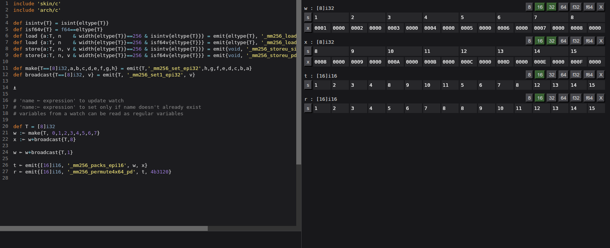

# Singeli playground

Evalutes [Singeli](https://github.com/mlochbaum/Singeli) code in an interactive environment with viewable and modifiable vector variable watches

### Usage
1. Clone [Singeli](https://github.com/mlochbaum/Singeli)
2. `./build.py`
3. `./run cbqn path/to/Singeli`

Code before `⍎` appears outside any scope, thus can be imports/exports/generators. After `⍎`, the code will be placed inside a function that reads stored variables and stores updated ones.

After `⍎`, you can use `name ← someValue` at the start of a line to create a watch of the value (which also defines `name` as a variable you can use). Currently, the type of the watch is tied to the first displayed layout, and you need to remove the watch if its width changes.

Run code with ctrl+s or ctrl+enter (or alt+enter or shift+enter).  
Switching to assembly or IR tabs does so automatically upon opening (but not the variables tab due to it possibly mutating stuff), but should be done manually after modifying code.

ctrl+numpad-plus/ctrl+numpad-minus change interface scale.